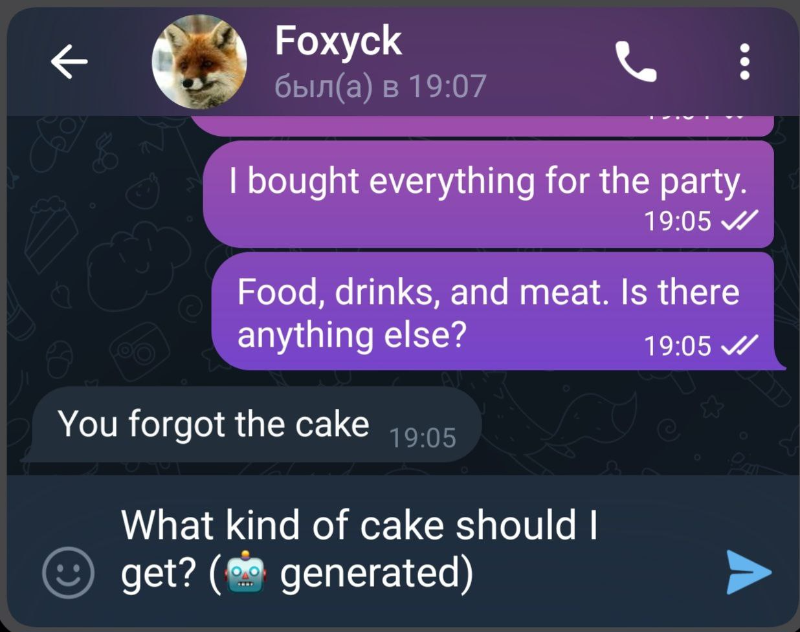

# Telegram Ambient Agent

Telegram Ambient Agent - это AI-агент, который помогает пользователю отвечать в Telegram. 

Он просматривает ваши входящие сообщения и создает draft-ответы (неотправленные сообщения). Вы сможете просмотреть и отредактировать предлагаемое ботом сообщение перед отправкой.



**Важно!** Это не Telegram-бот, а эмулятор Telegram-клиента. Поэтому для подключения потребуется авторизоваться в своем Telegram-аккаунте.


## Установка

1. Клонируйте репозитарий, создайте виртуальное окружение, установите зависимости
```bash
git clone https://github.com/Rai220/telegram_ambient_agent.git
cd telegram_ambient_agent
python -m venv .venv
source .venv/bin/activate
pip install -r requirements.txt
```
2. Переименуйте файл .env_example в .env
```bash
mv .env_example .env
```
3. Получите TELEGRAM_API_ID и TELEGRAM_API_HASH по адресу https://my.telegram.org 
4. Отредактируйте файл .env - укажите ключи для доступа к telegram и openai api key.

## Использование

1. Запустите скрипт `main.py`:
```bash
python main.py
```
2. При первом запуске приложение попросит авторизоваться в Telegram
3. Бот будет писать драфты на непрочитанные сообщения каждые 5 минут

## Кастомизация

Отредактируйте файл `settings.py` под свои требования